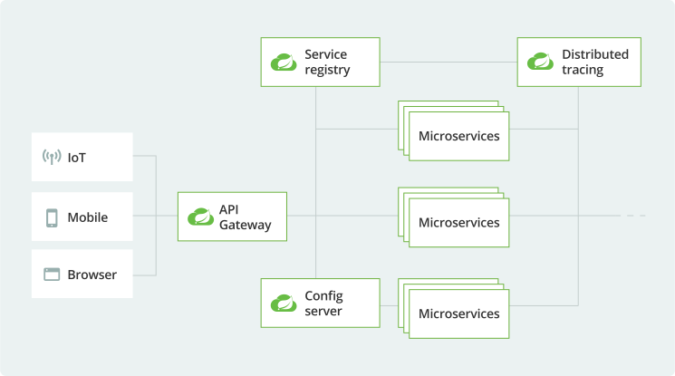

# Microservices and Distributed Systems
This project is where I'm applying what I've learned about microservices and Spring-related technologies. I'm using Spring Boot to build a system with microservices architecture, incorporating tools and concepts like Kubernetes, RabbitMQ, Kafka, and API Gateway security. 
Each update demonstrates my progress, including service communication, message-driven architecture, and securing APIs.

## **📚 Course Curriculum**

## **1. Getting Started**
- **Customer**: Service responsible for handling customer registration.
- **Fraud**: a fraud detection Service &rarr; Mocking without external provider (3rd party API).


## **2. Bootstrap With Maven**
1- **Download** Maven & **Extract** the Zip file 👉 [Download Apache Maven](https://maven.apache.org/download.cgi) <br/>
2- Set **Environment Variables** > **System Variables** "MAVEN_HOME"<br/> `C:\Program Files\Apache\Maven\apache-maven-3.9.6`<br/>
3- Add maven to **path variable** under System Variables<br/>
`%MAVEN_HOME%\bin`<br/>
4- **Verify** Installation:
```
mvn -v
```
5- Creating a Project
```bash
cd desktop

# Generate a new Maven project
mvn archetype:generate -DgroupId=org.agcodes -DartifactId=microservices -DarchetypeArtifactId=maven-archetype-quickstart -DarchetypeVersion=1.5 -DinteractiveMode=false

cd microservices

# Display the directory structure of the current folder
tree 
# Display the directory structure & all files in each folder
tree /f
```
6- Open the Project with IntelliJ <br/>
7- File> project structure> SDK > JAVA JDK 17 <br/>
8- **Maven Multi-Module [pom.xml]**:
- delete "/src" folder: as this is the parent module
- **dependencyManagement**: Specifies `version` and `scope` of `dependencies` for child POMs, Child POMs `inherit the rules`, but don’t get the dependency `unless they declare it`.
 [Centralizes dependency versions; used by child POMs.]
- **dependencies**:It’s `included` and `ready to use` by the child POM.
- **pluginManagement**: Defines `default configuration` for plugins, Child POMs `inherit the config`, but don’t get the plugin unless they include it.
- **plugin**:It’s `included` and `ready to use` by the child POM.

 ```xml
 	<properties>
		<java.version>17</java.version>
		<spring.boot.maven.plugin.version>2.5.7</spring.boot.maven.plugin.version>
		<spring.boot.dependencies.version>2.5.7</spring.boot.dependencies.version>
	</properties>

``` 

```xml
	<dependencyManagement>
		<dependencies>
			<dependency>
				<groupId>org.springframework.boot</groupId>
				<artifactId>spring-boot-dependencies</artifactId>
				<version>${spring.boot.dependencies.version}</version>
				<scope>import</scope>
				<type>pom</type>
			</dependency>
		</dependencies>
	</dependencyManagement>
```
```xml

	<dependencies>
		<dependency>
			<groupId>org.projectlombok</groupId>
			<artifactId>lombok</artifactId>
		</dependency>
		<dependency>
			<groupId>org.springframework.boot</groupId>
			<artifactId>spring-boot-starter-test</artifactId>
		</dependency>
	</dependencies>

```

```xml
<build>
		<pluginManagement>
			<plugins>
				<plugin>
					<groupId>org.springframework.boot</groupId>
					<artifactId>spring-boot-maven-plugin</artifactId>
					<version>${spring.boot.maven.plugin.version}</version>
				</plugin>
			</plugins>
		</pluginManagement>
	</build>
```
## **3. Your First Microservice:**

- **Microservices**: Microservice architectures are the ‘new normal’. Building `small`, `self-contained`, `ready to run` applications can bring great `flexibility` and added `resilience` to your code. Spring Boot’s many purpose-built features make it easy to build and run your microservices in production at scale. And don’t forget, no microservice architecture is complete without `Spring Cloud` ‒ easing administration and boosting your fault-tolerance.

- **Cloud**: Developing distributed systems can be challenging. Complexity is moved from the application layer to the network layer and demands greater interaction between services. Making your code ‘cloud-native’ means dealing with 12-factor issues such as external configuration, statelessness, logging, and connecting to backing services. The Spring Cloud suite of projects contains many of the services you need to make your applications run in the cloud. <br/>
1- **Service discovery**<br/>
2- **API gateway**<br/>
3- **Cloud configuration**<br/>
4- **Circuit breakers**<br/>
5- **Tracing**<br/>
6- **Testing**<br/>

- **Spring Cloud architecture highlights:**


1- Creating **1st Microservice app**:<br/>
Right click on parent project > `new module` > customer. <br/>
2- Parent pom.xml generates:
```xml
<modules>
		<module>customer</module>
</modules>
```
3- create customer/resources/**banner.txt** using 👉 [Generate Banner](https://devops.datenkollektiv.de/banner.txt/index.html) <br/>
4- Create:
 - customer Model &rarr; Class
 - customer Repository  &rarr; Interface
 - Service, Controller, DTO &rarr; Record gives you: <br/>
 1- Auto-generated constructor &rarr; **constructor-based injection** "promotes **immutability**" (final fields) <br/>
 2- equals(), hashCode(), toString() [Reduces boilerplate code] <br/>
 3- Final fields (immutable) <br/>

 ✅ ***constructor-based injection***:  You no longer need to explicitly annotate constructors with `@Autowired` for Spring to inject dependencies — Spring does it **automatically** if there is **only one constructor** in the class.
 (especially Spring 4.3+ and Spring Boot 3+)


 ***🔐 What is immutability?*** An immutable object is an object whose state (data/fields) cannot change after it's created:
1) All fields are **final** <br/>
2) **No setters** are provided <br/>
3) Object is fully **initialized in the constructor** <br/>


5- Create `docker-compose.yml` in **parent module**. <br/>
- **Docker Image** [Recipe]:  A read-only blueprint that `contains everything` needed to `run an application` (like code, libraries, and config).

- **Docker Container** [Final Dish]: A `running instance` of an `image` — it's the actual app or service running in an isolated environment.
```bash
# Starts all the services defined in your docker-compose.yml file
# -d "detached mode" → runs the containers in the background.
docker compose up -d

# Lists the status of the containers created by your docker-compose.yml
docker compose ps
```
6- modify `application.yml` in **customer module** with `database connections`. <br/>
7- Add `Spring Web`,`JPA` & `Postgres` dependencies in `pom.xml` in **customer module**. <br/>
8- Testing the controller using Postman

### ✅ Lombok Annotations;

| Annotation            | Purpose                                                    |
| --------------------- | ---------------------------------------------------------- |
| `@Data`               | Generates getters, setters, `toString()`, `equals()`, etc. |
| `@Builder`            | Enables builder easily build objects using **chained method** calls pattern &rarr; ```User user = User.builder().name("Bob").age(30).build();```                                    |
| `@AllArgsConstructor` | Full-argument constructor                                  |
| `@NoArgsConstructor`  | Empty constructor [Required by frameworks like **JPA**, **Jackson**]                                         |

## **4. Microservice Communication via HTTP:**

1- Creating a new module **fraud** &rarr;
Right click on parent project > `new module` > Fraud. <br/>
2- Create fraud/resources/**banner.txt** <br/>
3- Create:
 - Fraud Model, Service, Controller &rarr; Class (the service isn't a record as it needs to have logic & We might not be using the latest Java version)
 - Fraud Repository  &rarr; Interface
 - DTO &rarr; Record
 #### ✅ How microservices communicate using:
1) RestTemplate
2) Eureka Service Discovery
3) OpenFeign

4- modify `application.yml` in **Fraud module** with `database connections`. <br/>
**In a typical microservices architecture:**
Each microservice should ideally have its own database (by adding a new service in docker-compose.yml).<br/>
&rarr; This ensures loose coupling, data ownership, and independent scaling. <br/>
&rarr; But... in **local development** or **limited-resource** environments (like your laptop or small test server), it’s common and practical to: <br/>
👉 Use a **shared PostgreSQL container** and isolate each service using **separate schemas**.<br/>
5- Add `Spring Web`,`JPA` & `postgres` dependencies in `pom.xml` <br/>
6- Testing the controllers (customer & fraud) using Postman <br/>


## **5. Service Discovery with Eureka:**