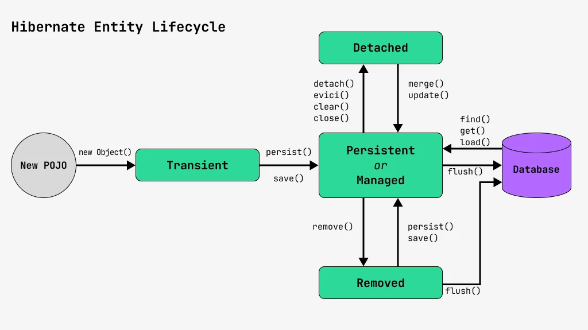

# Microservices and Distributed Systems
This project is where I'm applying what I've learned about microservices and Spring-related technologies. I'm using Spring Boot to build a system with microservices architecture, incorporating tools and concepts like Kubernetes, RabbitMQ, Kafka, and API Gateway security. 
Each update demonstrates my progress, including service communication, message-driven architecture, and securing APIs.

## **📚 Course Curriculum**

## **1. Getting Started**
- **Customer**: Service responsible for handling customer registration.
- **Fraud**: a fraud detection Service &rarr; Mocking without external provider (3rd party API).
- **Spring Cloud**: Provides tools to quickly build some of the common patterns in distributed systems(e.g, configuration management, service discovery, circuit breakers, load balancing, ...)
- **Service Discovery**: Process of automatically detecting devices and services on a network. **[Register - Look - Connect]**


## **2. Bootstrap With Maven**
1- **Download** Maven & **Extract** the Zip file 👉 [Download Apache Maven](https://maven.apache.org/download.cgi) <br/>
2- Set **Environment Variables** > **System Variables** "MAVEN_HOME"<br/> `C:\Program Files\Apache\Maven\apache-maven-3.9.6`<br/>
3- Add maven to **path variable** under System Variables<br/>
`%MAVEN_HOME%\bin`<br/>
4- **Verify** Installation:
```
mvn -v
```
5- Creating a Project
```bash
cd desktop

# Generate a new Maven project
mvn archetype:generate -DgroupId=org.agcodes -DartifactId=microservices -DarchetypeArtifactId=maven-archetype-quickstart -DarchetypeVersion=1.5 -DinteractiveMode=false

cd microservices

# Display the directory structure of the current folder
tree 
# Display the directory structure & all files in each folder
tree /f
```
6- Open the Project with IntelliJ <br/>
7- File> project structure> SDK > JAVA JDK 17 <br/>
8- **Maven Multi-Module [pom.xml]**:
- delete "/src" folder: as this is the parent module
- **dependencyManagement**: Specifies `version` and `scope` of `dependencies` for child POMs, Child POMs `inherit the rules`, but don’t get the dependency `unless they declare it`.
 [Centralizes dependency versions; used by child POMs.]
- **dependencies**:It’s `included` and `ready to use` by the child POM.
- **pluginManagement**: Defines `default configuration` for plugins, Child POMs `inherit the config`, but don’t get the plugin unless they include it.
- **plugin**:It’s `included` and `ready to use` by the child POM.

 ```xml
 	<properties>
		<java.version>17</java.version>
		<spring.boot.maven.plugin.version>2.5.7</spring.boot.maven.plugin.version>
		<spring.boot.dependencies.version>2.5.7</spring.boot.dependencies.version>
	</properties>

``` 

```xml
	<dependencyManagement>
		<dependencies>
			<dependency>
				<groupId>org.springframework.boot</groupId>
				<artifactId>spring-boot-dependencies</artifactId>
				<version>${spring.boot.dependencies.version}</version>
				<scope>import</scope>
				<type>pom</type>
			</dependency>
		</dependencies>
	</dependencyManagement>
```
```xml

	<dependencies>
		<dependency>
			<groupId>org.projectlombok</groupId>
			<artifactId>lombok</artifactId>
		</dependency>
		<dependency>
			<groupId>org.springframework.boot</groupId>
			<artifactId>spring-boot-starter-test</artifactId>
		</dependency>
	</dependencies>

```

```xml
<build>
		<pluginManagement>
			<plugins>
				<plugin>
					<groupId>org.springframework.boot</groupId>
					<artifactId>spring-boot-maven-plugin</artifactId>
					<version>${spring.boot.maven.plugin.version}</version>
				</plugin>
			</plugins>
		</pluginManagement>
	</build>
```
## **3. Your First Microservice:**

- **Microservices**: Microservice architectures are the ‘new normal’. Building `small`, `self-contained`, `ready to run` applications can bring great `flexibility` and added `resilience` to your code. Spring Boot’s many purpose-built features make it easy to build and run your microservices in production at scale. And don’t forget, no microservice architecture is complete without `Spring Cloud` ‒ easing administration and boosting your fault-tolerance.

- **Cloud**: Developing distributed systems can be challenging. Complexity is moved from the application layer to the network layer and demands greater interaction between services. Making your code ‘cloud-native’ means dealing with 12-factor issues such as external configuration, statelessness, logging, and connecting to backing services. The Spring Cloud suite of projects contains many of the services you need to make your applications run in the cloud. <br/>
1- **Service discovery**<br/>
2- **API gateway**<br/>
3- **Cloud configuration**<br/>
4- **Circuit breakers**<br/>
5- **Tracing**<br/>
6- **Testing**<br/>

- **Spring Cloud architecture highlights:**


1- Creating **1st Microservice app**:<br/>
Right click on parent project > `new module` > customer. <br/>
2- Parent pom.xml generates:
```xml
<modules>
		<module>customer</module>
</modules>
```
3- create customer/resources/**banner.txt** using 👉 [Generate Banner](https://devops.datenkollektiv.de/banner.txt/index.html) <br/>
4- Create:
 - customer Model &rarr; Class
 - customer Repository  &rarr; Interface
 - Service, Controller, DTO &rarr; Record gives you: <br/>
 1- Auto-generated constructor &rarr; **constructor-based injection** "promotes **immutability**" (final fields) <br/>
 2- equals(), hashCode(), toString() [Reduces boilerplate code] <br/>
 3- Final fields (immutable) <br/>

 ✅ ***constructor-based injection***:  You no longer need to explicitly annotate constructors with `@Autowired` for Spring to inject dependencies — Spring does it **automatically** if there is **only one constructor** in the class.
 (especially Spring 4.3+ and Spring Boot 3+)


 ***🔐 What is immutability?*** An immutable object is an object whose state (data/fields) cannot change after it's created:
1) All fields are **final** <br/>
2) **No setters** are provided <br/>
3) Object is fully **initialized in the constructor** <br/>


5- Create `docker-compose.yml` in **parent module**. <br/>
- **Docker Image** [Recipe]:  A read-only blueprint that `contains everything` needed to `run an application` (like code, libraries, and config).

- **Docker Container** [Final Dish]: A `running instance` of an `image` — it's the actual app or service running in an isolated environment.
```bash
# Starts all the services defined in your docker-compose.yml file
# -d "detached mode" → runs the containers in the background.
docker compose up -d

# Lists the status of the containers created by your docker-compose.yml
docker compose ps
```
6- modify `application.yml` in **customer module** with `database connections`. <br/>
7- Add `Spring Web`,`JPA` & `Postgres` dependencies in `pom.xml` in **customer module**. <br/>
8- Testing the controller using Postman

### ✅ Lombok Annotations;

| Annotation            | Purpose                                                    |
| --------------------- | ---------------------------------------------------------- |
| `@Data`               | Generates getters, setters, `toString()`, `equals()`, etc. |
| `@Builder`            | Enables builder easily build objects using **chained method** calls pattern &rarr; ```User user = User.builder().name("Bob").age(30).build();```                                    |
| `@AllArgsConstructor` | Full-argument constructor                                  |
| `@NoArgsConstructor`  | Empty constructor [Required by frameworks like **JPA**, **Jackson**]                                         |

## **4. Microservice Communication via HTTP:**

1- Creating a new module **fraud** &rarr;
Right click on parent project > `new module` > Fraud. <br/>
2- Create fraud/resources/**banner.txt** <br/>
3- Create:
 - Fraud Model, Service, Controller &rarr; Class (the service isn't a record as it needs to have logic & We might not be using the latest Java version)
 - Fraud Repository  &rarr; Interface
 - DTO &rarr; Record
 #### ✅ How microservices communicate using:
1) RestTemplate (via HTTP)
2) Eureka Service Discovery (to eliminate the use of ports/ when we use kubernetes we won't need Eureka Service)
3) OpenFeign

4- modify `application.yml` in **Fraud module** with `database connections`. <br/>
**In a typical microservices architecture:**
Each microservice should ideally have its own database (by adding a new service in docker-compose.yml).<br/>
&rarr; This ensures loose coupling, data ownership, and independent scaling. <br/>
&rarr; But... in **local development** or **limited-resource** environments (like your laptop or small test server), it’s common and practical to: <br/>
👉 Use a **shared PostgreSQL container** and isolate each service using **separate schemas**.<br/>
5- Add `Spring Web`,`JPA` & `postgres` dependencies in `pom.xml` <br/>
6- Adding **Config/CustomerConfiguration** & **RestTemplate** in customer's service
```java
@Configuration
public class CustomerConfiguration {
  @Bean
  public RestTemplate restTemplate(){
    return new RestTemplate();
  }
}
```
```java
// "saveAndFlush" To save the customer to db and generates an Id
// Without @Transactional: executes SQL insert committed immediately
customerRepository.saveAndFlush(customer);

FraudCheckResponse fraudCheckResponse = restTemplate.getForObject(
        "http://localhost:8081/api/v1/fraud-check/{customerId}"
        , FraudCheckResponse.class
        , customer.getId()
);
```

#### 🔄 Revisiting Hibernate Entity lifecycle:
- **Transient** (that is not yet saved to DB/ Hibernate is unaware of it/ No database interaction) → **Persistent**: By calling entityManager.`persist(entity)` or repository.`save(entity)`.

- **Persistent** → **Detached**: Happens automatically when the session/transaction closes, or explicitly via `detach()`.

- **Persistent** → **Removed**: By calling `remove(entity)`.

- **Detached** → **Persistent**: By calling `merge(entity)` to reattach the entity.

- **Removed** → **Deleted** (physically from DB): On `flush()` or `commit()`.


#### ✅ ACID Properties:
ACID is a set of **properties** that ensure **reliable** and **consistent** database transactions.

| **Property**        | **Meaning**                                                                     | **Bank Transfer Analogy**                                                                   | **Guarantee**                                      | **Failure Example Prevented**                      |
| ------------------- | ------------------------------------------------------------------------------- | ------------------------------------------------------------------------------------------- | -------------------------------------------------- | -------------------------------------------------- |
| **A** - Atomicity   | A transaction is **all-or-nothing** — if any part fails, everything rolls back. | If \$100 is debited from Account A but **can’t be credited to B**, the debit is undone.     | No partial changes — full success or full rollback | Only part of a multi-step operation is saved       |
| **C** - Consistency | The DB moves from one **valid state to another**, respecting all constraints.   | After transfer, **total money in A + B is still correct** — no extra or missing funds.      | Always valid data that obeys rules/constraints     | Violating unique, foreign key, or balance rules    |
| **I** - Isolation   | Each transaction acts as if it’s the **only one running**.                      | Two users transferring money simultaneously won’t interfere or see each other's updates.    | No interference between concurrent transactions    | Dirty reads, non-repeatable reads, race conditions |
| **D** - Durability  | Once committed, data is **permanently stored**, even after system failures.     | If system crashes after transfer, **data is still saved** — money isn’t lost or duplicated. | Data changes persist after commit                  | Data loss after crash or power failure             |
<br/>

| **Database Type**                     | **ACID by Default?** |
| ------------------------------------- | -------------------- |
| Relational (SQL)                      | ✅ Yes                |
| Most NoSQL (MongoDB, Cassandra, etc.) | ❌ No (BASE model)    |

- If your application needs `banking`, `orders`, `inventory`, or `sensitive data`, choose a **fully ACID-compliant DB**.

- If you prioritize `speed`, horizontal `scaling`, or `flexible schemas`, **NoSQL** might be better — but you’ll need to handle consistency yourself.

7- Testing the controllers (customer & fraud) using Postman <br/>


## **5. Service Discovery with Eureka:**
#### 🎯 Problem solved by Service Discovery:
If we have **M instances** of a **microservice** (e.g, Fraud Service running on ports 8081, 8082, 8083)
a **client** (like Customer Service) can’t **hard-code** or **keep track** of all those ports and IPs **manually**.
#### ⚠️Eureka Server is unavailable:
- It becomes a **single point** of **failure** unless it's made highly available.


- **Service Discovery**: Process of automatically detecting devices and services on a network.**[Register - Look - Connect]**


#### 👉 Steps for Eureka Server:
1- Adding spring cloud dependency to parent `pom.xml`:
```xml
<properties>
		<spring-cloud.version>2020.0.3</spring-cloud.version>
</properties>

<dependencyManagement>
<dependencies>
	<dependency>
				<groupId>org.springframework.cloud</groupId>
				<artifactId>spring-cloud-dependencies</artifactId>
				<version>${spring-cloud.version}</version>
				<type>pom</type>
				<scope>import</scope>
	</dependency>
</dependencyManagement>
</dependencies>
```

2- Creating **Eureka-server** module:<br/>
Right click on parent project > `new module` > Eureka-server.<br/>
and create Eureka-server/resources/**banner.txt** 
<br/>

3- Adding dependency to the **Eureka-server** `pom.xml`.<br/>
```xml
  <dependencies>
    <dependency>
      <groupId>org.springframework.cloud</groupId>
      <artifactId>spring-cloud-starter-netflix-eureka-server</artifactId>
    </dependency>
```
4- main class in **Eureka-server**:
```java
@SpringBootApplication
@EnableEurekaServer
public class EurekaServerApplication {

  public static void main(String[] args) {
    SpringApplication.run(EurekaServerApplication.class,args);

  }
}
```
5- create `application.yml` in **Eureka-server**:
```yml
server:
  port: 8761

spring:
  application:
    name: eureka-server # this name is used for server/clients in Eureka
  zipkin:
    base-url: http://localhost:9411

eureka:
  client:
    fetch-registry: false
    register-with-eureka: false
```

6- Register server client for customer & fraud `pom.xml` & `application.yml` & `main app`
```xml
<dependency>
	<groupId>org.springframework.cloud</groupId>
	<artifactId>spring-cloud-starter-netflix-eureka-client</artifactId>
</dependency>
```

```yml
eureka:
  client:
    service-url:
      defaultZone: http://localhost:8761/eureka
    fetch-registry: true            # default true
    register-with-eureka: true      # default true
```
```java
@SpringBootApplication
@EnableEurekaClient
public class FraudApplication {
	  public static void main(String[] args) {

    SpringApplication.run(FraudApplication.class,args);

  }
}
```
7- Modifying the **customer service** to communicate with fraud using Eureka server:
```java
FraudCheckResponse fraudCheckResponse = restTemplate.getForObject(
       // "http://localhost:8081/api/v1/fraud-check/{customerId}"
        "http://FRAUD/api/v1/fraud-check/{customerId}"
        , FraudCheckResponse.class
        , customer.getId()
);
```

8- Accessing Eureka server &rarr; http://localhost:8761/ <br/>
9- Trying to run the applications in below order: 
Eureka-server &rarr; fraud &rarr; customer <br/> 
Testing post request we'll get Server `UnknownHostException` as the rest template doesn't know which port to connect to [Load balancing] &rarr; `@LoadBalanced`<br/>
```java
@Configuration
public class CustomerConfiguration {
  @Bean
  @LoadBalanced
  public RestTemplate restTemplate(){
    return new RestTemplate();
  }
}
```

10- Testing a POST request to the Customer service and how Eureka with **RoundRobin load balancing** works with multiple instances of Fraud

