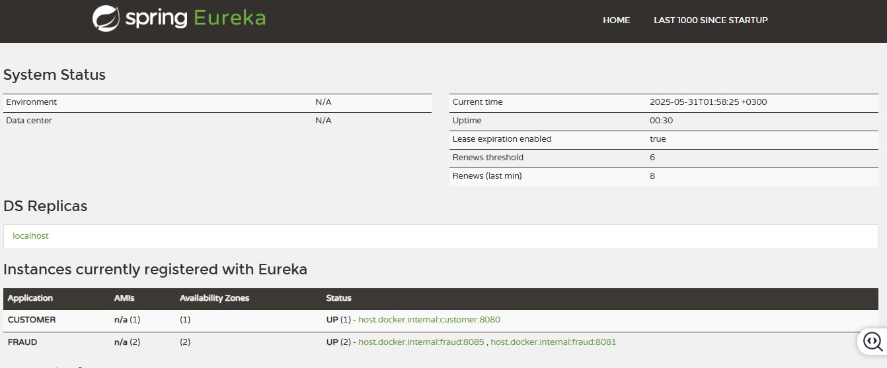

# Microservices and Distributed Systems
This project is where I'm applying what I've learned about microservices and Spring-related technologies. I'm using Spring Boot to build a system with microservices architecture, incorporating tools and concepts like Kubernetes, RabbitMQ, Kafka, and API Gateway security. 
Each update demonstrates my progress, including service communication, message-driven architecture, and securing APIs.

## **📚 Course Curriculum**

## **1. Getting Started**
- **Customer**: Service responsible for handling customer registration.
- **Fraud**: a fraud detection Service &rarr; Mocking without external provider (3rd party API).
- **Clients**: having all the clients for the microservices or any external clients (facebook,...) 
- **Spring Cloud**: Provides tools to quickly build some of the common patterns in distributed systems(e.g, configuration management, service discovery, circuit breakers, load balancing, ...)
- **Service Discovery**: Process of automatically detecting devices and services on a network. **[Register - Look - Connect]**


## **2. Bootstrap With Maven**
1- **Download** Maven & **Extract** the Zip file 👉 [Download Apache Maven](https://maven.apache.org/download.cgi) <br/>
2- Set **Environment Variables** > **System Variables** "MAVEN_HOME"<br/> `C:\Program Files\Apache\Maven\apache-maven-3.9.6`<br/>
3- Add maven to **path variable** under System Variables<br/>
`%MAVEN_HOME%\bin`<br/>
4- **Verify** Installation:
```
mvn -v
```
5- Creating a Project
```bash
cd desktop

# Generate a new Maven project
mvn archetype:generate -DgroupId=org.agcodes -DartifactId=microservices -DarchetypeArtifactId=maven-archetype-quickstart -DarchetypeVersion=1.5 -DinteractiveMode=false

cd microservices

# Display the directory structure of the current folder
tree 
# Display the directory structure & all files in each folder
tree /f
```
6- Open the Project with IntelliJ <br/>
7- File> project structure> SDK > JAVA JDK 17 <br/>
8- **Maven Multi-Module [pom.xml]**:
- delete "/src" folder: as this is the parent module
- **dependencyManagement**: Specifies `version` and `scope` of `dependencies` for child POMs, Child POMs `inherit the rules`, but don’t get the dependency `unless they declare it`.
 [Centralizes dependency versions; used by child POMs.]
- **dependencies**:It’s `included` and `ready to use` by the child POM.
- **pluginManagement**: Defines `default configuration` for plugins, Child POMs `inherit the config`, but don’t get the plugin unless they include it.
- **plugin**:It’s `included` and `ready to use` by the child POM.

 ```xml
 	<properties>
		<java.version>17</java.version>
		<spring.boot.maven.plugin.version>2.5.7</spring.boot.maven.plugin.version>
		<spring.boot.dependencies.version>2.5.7</spring.boot.dependencies.version>
	</properties>

``` 

```xml
	<dependencyManagement>
		<dependencies>
			<dependency>
				<groupId>org.springframework.boot</groupId>
				<artifactId>spring-boot-dependencies</artifactId>
				<version>${spring.boot.dependencies.version}</version>
				<scope>import</scope>
				<type>pom</type>
			</dependency>
		</dependencies>
	</dependencyManagement>
```
```xml

	<dependencies>
		<dependency>
			<groupId>org.projectlombok</groupId>
			<artifactId>lombok</artifactId>
		</dependency>
		<dependency>
			<groupId>org.springframework.boot</groupId>
			<artifactId>spring-boot-starter-test</artifactId>
		</dependency>
	</dependencies>

```

```xml
<build>
		<pluginManagement>
			<plugins>
				<plugin>
					<groupId>org.springframework.boot</groupId>
					<artifactId>spring-boot-maven-plugin</artifactId>
					<version>${spring.boot.maven.plugin.version}</version>
				</plugin>
			</plugins>
		</pluginManagement>
	</build>
```
## **3. Your First Microservice:**

- **Microservices**: Microservice architectures are the ‘new normal’. Building `small`, `self-contained`, `ready to run` applications can bring great `flexibility` and added `resilience` to your code. Spring Boot’s many purpose-built features make it easy to build and run your microservices in production at scale. And don’t forget, no microservice architecture is complete without `Spring Cloud` ‒ easing administration and boosting your fault-tolerance.

- **Cloud**: Developing distributed systems can be challenging. Complexity is moved from the application layer to the network layer and demands greater interaction between services. Making your code ‘cloud-native’ means dealing with 12-factor issues such as external configuration, statelessness, logging, and connecting to backing services. The Spring Cloud suite of projects contains many of the services you need to make your applications run in the cloud. <br/>
1- **Service discovery**<br/>
2- **API gateway**<br/>
3- **Cloud configuration**<br/>
4- **Circuit breakers**<br/>
5- **Tracing**<br/>
6- **Testing**<br/>

- **Spring Cloud architecture highlights:**


1- Creating **1st Microservice app**:<br/>
Right click on parent project > `new module` > customer. <br/>
2- Parent pom.xml generates:
```xml
<modules>
		<module>customer</module>
</modules>
```
3- create customer/resources/**banner.txt** using 👉 [Generate Banner](https://devops.datenkollektiv.de/banner.txt/index.html) <br/>
4- Create:
 - customer Model &rarr; Class
 - customer Repository  &rarr; Interface
 - Service, Controller, DTO &rarr; Record gives you: <br/>
 1- Auto-generated constructor &rarr; **constructor-based injection** "promotes **immutability**" (final fields) <br/>
 2- equals(), hashCode(), toString() [Reduces boilerplate code] <br/>
 3- Final fields (immutable) <br/>

 ✅ ***constructor-based injection***:  You no longer need to explicitly annotate constructors with `@Autowired` for Spring to inject dependencies — Spring does it **automatically** if there is **only one constructor** in the class.
 (especially Spring 4.3+ and Spring Boot 3+)


 ***🔐 What is immutability?*** An immutable object is an object whose state (data/fields) cannot change after it's created:
1) All fields are **final** <br/>
2) **No setters** are provided <br/>
3) Object is fully **initialized in the constructor** <br/>


5- Create `docker-compose.yml` in **parent module**. <br/>
- **Docker Image** [Recipe]:  A read-only blueprint that `contains everything` needed to `run an application` (like code, libraries, and config).

- **Docker Container** [Final Dish]: A `running instance` of an `image` — it's the actual app or service running in an isolated environment.
```bash
# Starts all the services defined in your docker-compose.yml file
# -d "detached mode" → runs the containers in the background.
docker compose up -d

# Lists the status of the containers created by your docker-compose.yml
docker compose ps
```
6- modify `application.yml` in **customer module** with `database connections`. <br/>
7- Add `Spring Web`,`JPA` & `Postgres` dependencies in `pom.xml` in **customer module**. <br/>
8- Testing the controller using Postman

### ✅ Lombok Annotations;

| Annotation            | Purpose                                                    |
| --------------------- | ---------------------------------------------------------- |
| `@Data`               | Generates getters, setters, `toString()`, `equals()`, etc. |
| `@Builder`            | Enables builder easily build objects using **chained method** calls pattern &rarr; ```User user = User.builder().name("Bob").age(30).build();```                                    |
| `@AllArgsConstructor` | Full-argument constructor                                  |
| `@NoArgsConstructor`  | Empty constructor [Required by frameworks like **JPA**, **Jackson**]                                         |

## **4. Microservice Communication via HTTP:**

1- Creating a new module **fraud** &rarr;
Right click on parent project > `new module` > Fraud. <br/>
2- Create fraud/resources/**banner.txt** <br/>
3- Create:
 - Fraud Model, Service, Controller &rarr; Class (the service isn't a record as it needs to have logic & We might not be using the latest Java version)
 - Fraud Repository  &rarr; Interface
 - DTO &rarr; Record
 #### ✅ How microservices communicate using:
1) RestTemplate (via HTTP)
2) Eureka Service Discovery (to eliminate the use of ports/ when we use kubernetes we won't need Eureka Service)
3) OpenFeign

4- modify `application.yml` in **Fraud module** with `database connections`. <br/>
**In a typical microservices architecture:**
Each microservice should ideally have its own database (by adding a new service in docker-compose.yml).<br/>
&rarr; This ensures loose coupling, data ownership, and independent scaling. <br/>
&rarr; But... in **local development** or **limited-resource** environments (like your laptop or small test server), it’s common and practical to: <br/>
👉 Use a **shared PostgreSQL container** and isolate each service using **separate schemas**.<br/>
5- Add `Spring Web`,`JPA` & `postgres` dependencies in `pom.xml` <br/>
6- Adding **Config/CustomerConfiguration** & **RestTemplate** in customer's service
```java
@Configuration
public class CustomerConfiguration {
  @Bean
  public RestTemplate restTemplate(){
    return new RestTemplate();
  }
}
```
```java
// "saveAndFlush" To save the customer to db and generates an Id
// Without @Transactional: executes SQL insert committed immediately
customerRepository.saveAndFlush(customer);

FraudCheckResponse fraudCheckResponse = restTemplate.getForObject(
        "http://localhost:8081/api/v1/fraud-check/{customerId}"
        , FraudCheckResponse.class
        , customer.getId()
);
```

#### 🔄 Revisiting Hibernate Entity lifecycle:
- **Transient** (that is not yet saved to DB/ Hibernate is unaware of it/ No database interaction) → **Persistent**: By calling entityManager.`persist(entity)` or repository.`save(entity)`.

- **Persistent** → **Detached**: Happens automatically when the session/transaction closes, or explicitly via `detach()`.

- **Persistent** → **Removed**: By calling `remove(entity)`.

- **Detached** → **Persistent**: By calling `merge(entity)` to reattach the entity.

- **Removed** → **Deleted** (physically from DB): On `flush()` or `commit()`.


#### ✅ ACID Properties:
ACID is a set of **properties** that ensure **reliable** and **consistent** database transactions.

| **Property**        | **Meaning**                                                                     | **Bank Transfer Analogy**                                                                   | **Guarantee**                                      | **Failure Example Prevented**                      |
| ------------------- | ------------------------------------------------------------------------------- | ------------------------------------------------------------------------------------------- | -------------------------------------------------- | -------------------------------------------------- |
| **A** - Atomicity   | A transaction is **all-or-nothing** — if any part fails, everything rolls back. | If \$100 is debited from Account A but **can’t be credited to B**, the debit is undone.     | No partial changes — full success or full rollback | Only part of a multi-step operation is saved       |
| **C** - Consistency | The DB moves from one **valid state to another**, respecting all constraints.   | After transfer, **total money in A + B is still correct** — no extra or missing funds.      | Always valid data that obeys rules/constraints     | Violating unique, foreign key, or balance rules    |
| **I** - Isolation   | Each transaction acts as if it’s the **only one running**.                      | Two users transferring money simultaneously won’t interfere or see each other's updates.    | No interference between concurrent transactions    | Dirty reads, non-repeatable reads, race conditions |
| **D** - Durability  | Once committed, data is **permanently stored**, even after system failures.     | If system crashes after transfer, **data is still saved** — money isn’t lost or duplicated. | Data changes persist after commit                  | Data loss after crash or power failure             |
<br/>

| **Database Type**                     | **ACID by Default?** |
| ------------------------------------- | -------------------- |
| Relational (SQL)                      | ✅ Yes                |
| Most NoSQL (MongoDB, Cassandra, etc.) | ❌ No (BASE model)    |

- If your application needs `banking`, `orders`, `inventory`, or `sensitive data`, choose a **fully ACID-compliant DB**.

- If you prioritize `speed`, horizontal `scaling`, or `flexible schemas`, **NoSQL** might be better — but you’ll need to handle consistency yourself.

7- Testing the controllers (customer & fraud) using Postman <br/>


## **5. Service Discovery with Eureka:**
#### 🎯 Problem solved by Service Discovery:
If we have **M instances** of a **microservice** (e.g, Fraud Service running on ports 8081, 8082, 8083)
a **client** (like Customer Service) can’t **hard-code** or **keep track** of all those ports and IPs **manually**.
#### ⚠️Eureka Server is unavailable:
- It becomes a **single point** of **failure** unless it's made highly available.


- **Service Discovery**: Process of automatically detecting devices and services on a network.**[Register - Look - Connect]**


#### 👉 Steps for Eureka Server:
1- Adding spring cloud dependency to parent `pom.xml`:
```xml
<properties>
		<spring-cloud.version>2020.0.3</spring-cloud.version>
</properties>

<dependencyManagement>
<dependencies>
	<dependency>
				<groupId>org.springframework.cloud</groupId>
				<artifactId>spring-cloud-dependencies</artifactId>
				<version>${spring-cloud.version}</version>
				<type>pom</type>
				<scope>import</scope>
	</dependency>
</dependencyManagement>
</dependencies>
```

2- Creating **Eureka-server** module:<br/>
Right click on parent project > `new module` > Eureka-server.<br/>
and create Eureka-server/resources/**banner.txt** 
<br/>

3- Adding dependency to the **Eureka-server** `pom.xml`.<br/>
```xml
  <dependencies>
    <dependency>
      <groupId>org.springframework.cloud</groupId>
      <artifactId>spring-cloud-starter-netflix-eureka-server</artifactId>
    </dependency>
```
4- main class in **Eureka-server**:
```java
@SpringBootApplication
@EnableEurekaServer
public class EurekaServerApplication {

  public static void main(String[] args) {
    SpringApplication.run(EurekaServerApplication.class,args);

  }
}
```
5- create `application.yml` in **Eureka-server**:
```yml
server:
  port: 8761

spring:
  application:
    name: eureka-server # this name is used for server/clients in Eureka
  zipkin:
    base-url: http://localhost:9411

eureka:
  client:
    fetch-registry: false
    register-with-eureka: false
```

6- Register server client for customer & fraud `pom.xml` & `application.yml` & `main app`
```xml
<dependency>
	<groupId>org.springframework.cloud</groupId>
	<artifactId>spring-cloud-starter-netflix-eureka-client</artifactId>
</dependency>
```

```yml
eureka:
  client:
    service-url:
      defaultZone: http://localhost:8761/eureka
    fetch-registry: true            # default true
    register-with-eureka: true      # default true
```
```java
@SpringBootApplication
@EnableEurekaClient
public class FraudApplication {
	  public static void main(String[] args) {

    SpringApplication.run(FraudApplication.class,args);

  }
}
```
7- Modifying the **customer service** to communicate with fraud using Eureka server:
```java
FraudCheckResponse fraudCheckResponse = restTemplate.getForObject(
       // "http://localhost:8081/api/v1/fraud-check/{customerId}"
        "http://FRAUD/api/v1/fraud-check/{customerId}"
        , FraudCheckResponse.class
        , customer.getId()
);
```

8- Accessing Eureka server &rarr; http://localhost:8761/ <br/>
9- Trying to run the applications in below order: 
Eureka-server &rarr; fraud &rarr; customer <br/> 
Testing post request we'll get Server `UnknownHostException` as the rest template doesn't know which port to connect to [Load balancing] &rarr; `@LoadBalanced`<br/>
```java
@Configuration
public class CustomerConfiguration {
  @Bean
  @LoadBalanced
  public RestTemplate restTemplate(){
    return new RestTemplate();
  }
}
```

10- Testing a POST request to the Customer service and how Eureka with **RoundRobin load balancing** works with multiple instances of Fraud



## **6. Open Feign:**
- **Open Feign**: **Java library** that lets you **call** other **web services** (APIs) using **simple Java interfaces** — no need to write boilerplate code like `RestTemplate` or `WebClient`.
- **Solves a problem**: Duplicate boilerplate code in which defining the same "FraudCheckResponse" class in both customer & Fraud services and writing manual HTTP client logic (RestTemplate, etc.)

- **Open Feign** handles:

1) **HTTP request creation**

2) **URL handling**

3) **Serialization** (converting Java to JSON and back)

4) **Load balancing** (when used with Spring Cloud)

#### 👉 Steps for Open Feign:
1- Creating **clients module**:<br/>
Right click on parent project > `new module` > clients.<br/>

2- Adding **Feign dependency** in the parent `pom.xml` dependencies to be used by all the sub-modules:
```xml
<dependencies>
	<dependency>
			<groupId>org.springframework.cloud</groupId>
			<artifactId>spring-cloud-starter-openfeign</artifactId>
	</dependency>
</dependencies>
```

3- Add **Fraud** package in **clients module** and create an interface & record as below:
```java
// Fraud interface
@FeignClient(
    value = "fraud",
    path = "api/v1/fraud-check"
)
public interface FraudClient {
  @GetMapping(path="{customerId}")
 FraudCheckResponse isFraudster(@PathVariable("customerId") Integer customerId);

}
```
```java
public record FraudCheckResponse(Boolean isFraudster) {

}
```

4- including the dependency in the **customer** `pom.xml` to be able to use our **client** module and enabling it in the main class `@EnableFeignClients`:
```xml
<dependencies>
	<dependency>
      <groupId>org.agcodes</groupId>
      <artifactId>clients</artifactId>
      <version>0.0.1-SNAPSHOT</version>
      <scope>compile</scope>
    </dependency>
</dependencies>
```
```java
@SpringBootApplication
@EnableEurekaClient
@EnableFeignClients(
    basePackages = "org.agcodes.clients"
)
public class CustomerApplication {
  public static void main(String[] args) {
    SpringApplication.run(CustomerApplication.class,args);
  }

}
```
5- Updating the **customer's service** using private final **FraudClient** & **fraudCheckResponse** from the clients package and delete the FraudCheckResponse class from the customer's module & Fraud's module:
```java
@Service
public record CustomerService(
						CustomerRepository customerRepository,
                        RestTemplate restTemplate,
                        FraudClient fraudClient){
						
						  FraudCheckResponse fraudCheckResponse = fraudClient.isFraudster(customer.getId());

public void registerCustomer(CustomerRegistrationRequest request) {
    Customer customer = Customer.builder()
        .firstName(request.firstName())
        .lastName(request.lastName())
        .email(request.email())
        .build();

    if(fraudCheckResponse.isFraudster()){
      throw new IllegalStateException("Fraudster!");
    }
}
}

```
6- Trying to run the applications in below order: 
Eureka-server &rarr; fraud &rarr; customer <br/> 
Testing post request to the **customer** controller and it works successfully <br/>

7- **When You Add a New Endpoint(method) to FraudController** = **You must also add a matching method to clients/fraud/FraudClient interface** to be availabe for other microservices to call it using Feign. <br/>

## **7. 💡 Exercise:**
 ### Add a Notification Microservice: 
 - In this exercise, you'll add a new microservice called notification that sends a notification to the customer after successful registration, if they are not marked as fraudsters. This setup will not use a message queue (like RabbitMQ or Kafka) — it will be a direct REST call using Feign.

 ### 🛠️ Steps to Complete the Exercise:
 1) **Create the notification Microservice**
 - Use Spring Initializr or copy an existing microservice structure (e.g. fraud or customer)
 - Add dependencies: Spring Web, Spring Data JPA, Eureka Client, Lombok.
 - **Create a Database Schema for Notification**: Add JPA entity Notification, repository, and service to store notification details.

```java 
// Notification Model
@Data
@Builder
@AllArgsConstructor
@NoArgsConstructor
@Entity
public class Notification {

  @Id
  @SequenceGenerator(
      name = "notification_id_sequence",
      sequenceName = "notification_id_sequence"
  )
  @GeneratedValue(
      strategy = GenerationType.SEQUENCE,
      generator = "notification_id_sequence"
  )
  private Integer notificationId;
  private Integer toCustomerId;
  private String toCustomerEmail;
  private String sender;
  private String message;
  private LocalDateTime sentAt;
}
```
```java
// Service
@Service
@AllArgsConstructor
public class NotificationService {

  private final NotificationRepository notificationRepository;

  public void send(NotificationRequest notificationRequest){
    notificationRepository.save(
        Notification.builder()
            .toCustomerId(notificationRequest.toCustomerId())
            .toCustomerEmail(notificationRequest.toCustomerName())
            .sender("Server")
            .message(notificationRequest.message())
            .sentAt(LocalDateTime.now())
            .build());
  }
  }
```
```java
// Controller
@RestController
@RequestMapping("api/v1/notification")
@AllArgsConstructor
@Slf4j
public class NotificationController {

  private final NotificationService notificationService;

  @PostMapping
  public void sendNotification(@RequestBody NotificationRequest notificationRequest){
    log.info("New notificationRequest {}",notificationRequest);
    notificationService.send(notificationRequest);
  }
}
```
 2) **Register notification with Eureka**
 - Add the required Eureka client config in `application.yml` & Set a unique spring.application.name=notification.:
 ```yml
 server:
  port: 8082

  spring:
  application:
    name: notification
  datasource:
    url: jdbc:postgresql://localhost:5433/notification
    username: 
    password: 
    driver-class-name: org.postgresql.Driver
  jpa:
    hibernate:
      ddl-auto: create-drop
    properties:
      hibernate:
        dialect: org.hibernate.dialect.PostgreSQLDialect
        format_sql: true
    show-sql: true
    logging:
      level:
        org.springframework.jdbc.core: DEBUG
 eureka:
  client:
    register-with-eureka: true
    fetch-registry: true
 ```
 3) **Create a Feign Client for Notification in the clients Module**
 - In the clients module, add an interface `NotificationClient`.
- Create a `NotificationRequest` **DTO class** in clients/notification.
```java
@FeignClient(
    path = "api/v1/notification",
    value = "notification"
)
public interface NotificationClient {
  @PostMapping
  public void sendNotification(@RequestBody NotificationRequest notificationRequest);
}
```
```java
public record NotificationRequest(
    Integer toCustomerId,
    String toCustomerName,
    String message
) {
}
```

### Final Test Scenario
- Send a POST request to **/api/v1/customers** to register a customer.
- Inside CustomerService, after checking the fraud response
- If not a fraudster, make a call to **NotificationClient.sendNotification(...)** to trigger the notification.
- Check that the notification is saved in the notification database and a log message is printed.

### ✅ Open Fiegn Annotations Summary:
| **Service**    | `@EnableEurekaClient`    | `@EnableFeignClients`                  | Why?                                     |
| -------------- | ------------------------ | -------------------------------------- | ---------------------------------------- |
| `customer`     | Optional (modern Spring) | ✅ Yes (calls `fraud` & `notification`) | Needs to scan and register Feign clients |
| `notification` | Optional (modern Spring) | ❌ Not needed                           | Doesn't call other services              |

## **8. Distributed Tracing:**
- **Spring Cloud Sleuth**: It provides spring boot **auto-configuration** for **distributed tracing**
as it automatically adds `tracing IDs` (**traceId** and **spanId**) to your logs, so you can trace the flow of a request across multiple microservices &rarr; making it easier to **diagnose issue** & **understand the interactions** between microservices.
- `traceId` for each incoming request.
- `spanId` for each step/service call (unique per service).

- **Zipkin [central tracing server]**: It is a **distributed tracing system** that **collects** and **visualizes** the `traces` added by **Sleuth** and Stores it (in memory or a database) &rarr; `http://localhost:9411`


#### 👉 Steps for Sleuth & Zipkin:
1. Adding sleuth dependency in **customer**, **eureka-server** & **fraud**, **notification** `pom.xml` and `application.yml`:
```xml
    <dependency>
      <groupId>org.springframework.cloud</groupId>
      <artifactId>spring-cloud-starter-sleuth</artifactId>
    </dependency>
    <dependency>
      <groupId>org.springframework.cloud</groupId>
      <artifactId>spring-cloud-sleuth-zipkin</artifactId>
    </dependency>
```
```yml
# Default Zipkin URL is "http://localhost:9411", but it's better to set it here so you can easily change it per environment (profiles)
  zipkin:
    base-url: http://localhost:9411
```
2. Adding Zipkin to `docker-compose.yml` and the environment is used to store the data to database(won't use it for now):
 ```yml
   zipkin:
    image: openzipkin/zipkin
    container_name: zipkin
    ports:
      - "9411:9411"
 ```
 - Terminal command:
 ```shell
 # Starts all the services defined in your docker-compose.yml file
 docker compose up -d
 # Prints all zipkin logs
 docker logs zipkin
 ```
3. Testing Post request to customer and check Terminal logs:
```cmd
# [ServiceName,TraceId,SpanId]
2025-06-01 22:42:10.736  INFO [customer,db4d579168bcdda8,db4d579168bcdda8]
```
4. Open zipkin through &rarr; http://127.0.0.1:9411/

## **9. Api Gateway With Spring Cloud Gateway:**
- **⚖️  Load Balancing**: is the process of **distributing** incoming **network traffic** across **multiple instances** of a service (e.g., multiple microservice instances) to ensure: 
1. High availability.
2. Scalability.
3. Better performance.
4. No single point of failure.

| **Type**            | **Explanation**                                                                             | **Example Tools**                                                                           |
| ------------------- | ------------------------------------------------------------------------------------------- | ------------------------------------------------------------------------------------------- |
| **1. Self-Managed** | You **set up** and **configure** your own load balancer inside your app or infrastructure.          | - Spring Cloud LoadBalancer<br>- Netflix Ribbon (deprecated)<br>- NGINX, HAProxy            |
| **2. Managed**      | Provided and managed by a **cloud provider** or **external service**. You don’t manage the details. | - AWS ELB (Elastic Load Balancer)<br>- Google Cloud Load Balancing<br>- Azure Load Balancer |

### ✅ Flow:


### 📊 Load Balancing Algorithms:
Different load balancing algorithms offer various benefits. The right choice depends on your application's needs:
1. **Round Robin**: Requests are sent to each server one after another in a repeating cycle (sequential)
2. **Least Connections**: A new request goes to the **server with the fewest** current client **connections**. It also considers the server’s capacity.
3. **Least Time (NGINX Plus only)**: : Sends the request to the server that is expected to **respond the fastest**, based on a **formula** **combining response time** and **number of connections**.
4. **Hash**: Distributes requests based on a **key** like the `client IP` or `URL`. NGINX Plus can use a **consistent hash** to avoid shifting loads when servers change.
5. **IP Hash**: Uses the **client’s IP address** to consistently route them to the **same server**.
6. **Random with Two Choices**: Picks **2 random servers**, then sends the request **to the one with fewer connections** or **faster response** (depending on the setup).

🔍 Quick Tips:
- **Round Robin** &rarr; for simple, equal-load scenarios.
- **Least Connections** or **Least Time** &rarr; when some servers might be busier than others.
- **Hash/IP Hash** &rarr; when session stickiness is important.
- **Random with Two Choices** &rarr; for better distribution without full overhead.

### 🔧 Health Check:
- A way to **monitor** if a service is **functioning properly**. It can be customized per service depending on what you want to verify.

- **Simple** Health checks &rarr; Checks if the service is up and running
- **Advanced** Health checks &rarr; verifies dependencies like: DB connection, External APIs, Message queues (MQ).

### 🌐 API Gateway: 
- Acts as a **single entry point** for all client requests - Provides a **simple & efficient way** to **route APIs** to different microservices.
- Provides **cross cutting concerns (CCC)**: 
1. **Security** (e.g., authentication, rate limiting)
2. **Monitoring** (e.g., logging, tracing)
3. **Resilience** (e.g., retries, timeouts, circuit breakers).

### ⚡ Circuit Breaker:
- When an **instance is unavailable** (Service behind the load balancer or API Gateway) &rarr; **send a default response** to clients.
- Prevents system overload when a service instance becomes unavailable.
- Instead of repeatedly trying a failing service, it:

1. 🛑 **Breaks** the circuit after **repeated failures**.

2. 📨 **Returns** a **fallback/default response** to the client

3. 🔁 **Tries** to **reconnect** after a **cool-down period**.

#### 👉 Steps for API Gateway:
1- Creating a **new module**:<br/>
Right click on parent project > `new module` > apigw <br/>
& add `resources/banner.txt`<br/>

2- Add dependencies in **apigw** `pom.xml`:
```xml
<dependencies>
    <dependency>
      <groupId>org.springframework.cloud</groupId>
      <artifactId>spring-cloud-starter-gateway</artifactId>
    </dependency>
    <dependency>
      <groupId>org.springframework.cloud</groupId>
      <artifactId>spring-cloud-starter-netflix-eureka-client</artifactId>
    </dependency>
    <dependency>
      <groupId>org.springframework.cloud</groupId>
      <artifactId>spring-cloud-starter-sleuth</artifactId>
      <version>3.0.3</version>
    </dependency>
    <dependency>
      <groupId>org.springframework.cloud</groupId>
      <artifactId>spring-cloud-sleuth-zipkin</artifactId>
    </dependency>
</dependencies>
```
3- Add `application.yml` configuration:
```yml
server:
  port: 8083

spring:
  application:
    name: api-gateway
  zipkin:
    base-url: http://localhost:9411
  cloud:
    gateway: 
      routes: # This is a list
        - id: customer
          uri: lb://CUSTOMER # Service name in eureka server
          predicates:
            - Path=/api/v1/customers/**

eureka:
  client:
    service-url:
      defaultZone: http://localhost:8761/eureka
    fetch-registry: true            # default true
    register-with-eureka: true      # default true

```
4- After starting all the services, we’ll send the POST request to the `apigw` (API Gateway) instead of sending it directly to the `customer service` — and the gateway will forward it to `customer` &rarr;
http://localhost:8083/api/v1/customers

## **10. Message Queues:**

#### ✅ Why Use Message Queues ?
1- **Avoid Delays in Main Service**: Your service would have to wait for the notification service to respond &rarr; A **queue** lets your main service continue immediately while the notification is handled **asynchronously**.

2- **Unknown Number of Notification Instances**: You might not know how many instances of services (like Firebase or Twilio) are needed to handle all the notifications &rarr; A **message queue** lets you **scale those services independently** based on the **load**.

3- **Better Error Handling**: If the notification service crashes or has a bug your whole request might fail &rarr; With a **queue**, the **message stays** there and can be **processed later** when the **service is back up**.

### ✅  Message Queues (e.g., RabbitMQ, Kafka) in Microservices:
1. `Non-blocking` – Avoid making the main service wait; **process tasks asynchronously**.

2. `Scalability` – Decouple services like Firebase/Twilio so they can **scale independently**.

3. `Resilience` – **Prevent data loss** if a service is down; messages stay in the queue and are processed later.

### 📨 AMQP (Advanced Message Queuing Protocol) 
**AMQP** is a **messaging protocol** used to **send messages** between services in a reliable, secure, and platform-independent way. It defines **how messages are sent**, **not just what format they use**.

| Component    | Role                                                                                                                          |
| ------------ | ----------------------------------------------------------------------------------------------------------------------------- |
| **Messages** | JSON Payload                                |
| **Producer** | Sends the message                           |
| **Consumer** | Receives and processes the message                                                      | **Exchange**   | **Routes** the message **based on** type or key |
| **Queue**    | **Stores** the message until consumed                                                     |
| **Broker**   | 🧠 **Handles everything**: receives messages from **producer**, routes them through **exchanges**, stores them in **queues**, and delivers to **consumers** |

- Since it's a **network protocol**, the publisher (producer), consumer, broker can all reside on **different machines**.


- **Loose coupling**: each microservice can reside on different machine
- **Performance**: If notification service is down, the clients can still send msgs to the `Notification Queue` and consumer can pull the msgs when it's back on.
- **Scaling**: We can run the broker as a cluster on 1-2 machines.
- **Language agnostic**: (language-independent) <br/>
Fraud &rarr; written in Java. <br/>
Notification &rarr; written in Golang.<br/>
- **Acks - Acknowlegment**: The message doesn't get removed from the queue &rarr; unless the consumer acknowledges the broker that it has received the message.
- **Cloud**: Whenever you dockerize your app you can run it easily on any docker provider (AWS, Azure, Google cloud,...)

### 📦 Message Queues:

1- **Apache Kafka**: 
- Open-source **distributed event streaming** platform.
- High throughput.
- Scalable.
- Permanent storage: Stores data in a distributed cluster.
- High availability: Efficiently stretches clusters across availability zones or connects separate clusters across geographic regions.

2- **Rabbit MQ**:
- One of the **most widely used** open-source message brokers (simple to get started).

3- **Amazon SQS (Simple Queue Service)**:
- **Fully managed** message queue service for microservices.

- **Disadvantage**: Vendor lock-in — you can't easily move to another cloud provider.

### 3 Core Concepts in Messaging:
1- 📮 **Exchange**:
- The **component** that **receives messages** from `producers` and **decides** how to **route** them to queues.
- It doesn’t store messages — it just forwards them based on rules (bindings).

2- 🔗 **Binding**:
- A **rule** that **connects** an `exchange` to a `queue`.
- It can include a routing key or pattern, depending on the exchange type.

3- 🚦 **Routing**:
- The **process** of deciding which queue(s) receive the message, based on the **exchange type** and **binding rules**.


### "Exchange" Types:
**1- 🧷 Direct** = **Exact match** (key to queue) <br/>
&rarr; routingKey = "email" delivered only to queues bound with "email"

**2- 📢 Fanout** = **Broadcast** (to all queues).

**3- 🔍 Topic** = **Pattern match** (wildcards * and # in keys) (flexible).<br/>
&rarr; * matches exactly one word<br/>
\# matches zero or more words<br/>
`user.*` -> routingKey = "user.login"<br/>
`user.#` -> routingKey = "user.profile.edit"<br/>

**4- 🧾 Headers** = Filter by **headers** (advanced). `e.g., x-match: all`  
**5- 📬 Nameless** (Default) = Shortcut (**routing key** = **queue name**).<br/>
&rarr; routingKey = `"orderQueue"` directly to the queue named `"orderQueue"`


## **11. Rabbit MQ in action:**

#### 👉 Steps for Rabbit MQ:
1- Adding rabbitMQ configs to `docker-compose.yml` and open the console http://localhost:15672 (username: guest, password: guest by default):
```yml
rabbitmq:
    image: rabbitmq:3.9.11-management-alpine # alpine is the smallest image
    container_name: rabbitmq
    ports:
      # Host : Container
      - "5672:5672"  # RabbitMQ broker port (used by apps/services)
      - "15672":"15672" # RabbitMQ Management Console (access via browser) http://localhost:15672 (username: guest, password: guest by default).
```

```bash
# Starts all the services
docker compose up -d
```


2- Creating a **new module** for "Advanced Messaging Queue Protocol" **amqp**:<br/>
Right click on parent project > `new module` > amqp. <br/>
and add **rabbitMQ dependency** to amqp's `pom.xml`:
```xml
  <dependencies>
    <dependency>
      <groupId>org.springframework.boot</groupId>
      <artifactId>spring-boot-starter-amqp</artifactId>
    </dependency>
  </dependencies>
```

3- **"Sending MSGs"** <br/>
 Add new class for rabbitMQ bean configuration **ampq/config/RabbitMQConfig**:
`Jackson2JsonMessageConverter` do?
- It uses Jackson (the default JSON library in Spring Boot) to:

- 🔁 Convert Java object ➝ JSON when **sending** a message.

- 🔁 Convert JSON ➝ Java object when **receiving** a message.

`Jackson2ObjectMapperBuilder`.json().modules() :
-  which helps you **customize Jackson’s ObjectMapper** especially to **register modules** that **help** with **special data types** like LocalDate, Optional, etc.

```java

@Configuration
@AllArgsConstructor
public class RabbitMQConfig {

  private final ConnectionFactory connectionFactory;
  @Bean
  public AmqpTemplate amqpTemplate() {
    RabbitTemplate rabbitTemplate = new RabbitTemplate(connectionFactory);
   rabbitTemplate.setMessageConverter(jacksonConverter());
    return rabbitTemplate;
  }

  @Bean
  public MessageConverter jacksonConverter(){
    // Configuring a bean that serialize/convert Java objects to JSON as RabbitMQ (and most message brokers) send/receive messages as "raw bytes" 
    // Useful in case of passing a JSON Object Mapper
    // Example
    /*
     Jackson2ObjectMapperBuilder jsonBuilder = Jackson2ObjectMapperBuilder.json()
            .modules(new JavaTimeModule()) // Support for Java 8 date/time
            .featuresToDisable(SerializationFeature.WRITE_DATES_AS_TIMESTAMPS) // Format dates as ISO-8601
            .serializationInclusion(JsonInclude.Include.NON_NULL) // Ignore null fields
            .indentOutput(true) // Pretty print JSON
            .build();
    */
    Jackson2JsonMessageConverter messageConverter = new Jackson2JsonMessageConverter();
    return messageConverter;
  }
}
```


4- **"Consume/Receive MSGs (Listener)"** <br/>
Adding this bean to **ampq/config/RabbitMQConfig** class:
```java
  @Bean
  public SimpleRabbitListenerContainerFactory rabbitListenerContainerFactory() {
    SimpleRabbitListenerContainerFactory factory = new SimpleRabbitListenerContainerFactory();
    factory.setConnectionFactory(connectionFactory);
    factory.setMessageConverter(jacksonConverter());
    return factory;
  }
```
5- Set the **dependency** for **RabbitMQ** in `customer` & `notification` modules:
```xml
<dependency>
   <groupId>org.springframework.boot</groupId>
   <artifactId>spring-boot-starter-amqp</artifactId>
</dependency>

<dependency>
  <groupId>org.agcodes</groupId>
  <artifactId>amqp</artifactId>
  <version>0.0.1-SNAPSHOT</version>
</dependency>
```
6- Adding queue config in notification's `application.yml`:
```yml
spring:
  rabbitmq:
    addresses: localhost:5672

rabbitmq:
  exchanges:
    internal: internal.exchange # Exchange name
  queue:
    notification: notification.queue # Queue name
  routing-keys:
    internal-notification: internal.notification.routing-key # Routing key: How to bind the exchange to queue
```
7- **"Defining Exchange+Binding+Queue"** by creating a new class in **notification/config/NotificationConfig** to get the values from `application.yml` based on different profiles (e.g. dev, prod, etc.) to follow the best practices:
```java
@Configuration
public class NotificationConfig {

  @Value("${rabbitmq.exchanges.internal}")
  private String internalExchange;

  @Value("${rabbitmq.queues.notification}")
  private String notificationQueue;

  @Value("${rabbitmq.routing-keys.internal-notification}")
  private String internalNotificationRoutingKeys;

  @Bean
  public TopicExchange internalTopicExchange(){
    return new TopicExchange(this.internalExchange);
  }
  @Bean
  public Queue notificationQueue(){
    return new Queue(this.notificationQueue);
  }
  @Bean
  public Binding internalToNotificationBinding(){
    return BindingBuilder
        .bind(notificationQueue())
        .to(internalTopicExchange())
        .with(this.internalNotificationRoutingKeys);
  }

  public String getInternalExchange() {
    return internalExchange;
  }

  public String getNotificationQueue() {
    return notificationQueue;
  }

  public String getInternalNotificationRoutingKeys() {
    return internalNotificationRoutingKeys;
  }
}
```
8- Creating new class in **amqp** module:
- **config** &rarr; Queue, Exchange, Binding Beans
- **producer** &rarr; Message-sending logic
- **consumer** &rarr; (optional) for listeners/subscribers

```java 
// ampq/producer/RabbitMQMessageProducer

@Slf4j
@AllArgsConstructor
@Component
public class RabbitMQMessageProducer {

  private final AmqpTemplate amqpTemplate;
  public void publish(Object payload, String exchange, String routingKey) {
    log.info("publishing payload='{}' to exchange='{}' with routing key='{}'", payload, exchange, routingKey);
    amqpTemplate.convertAndSend(exchange, routingKey, payload);
    log.info("Published payload='{}' to exchange='{}' with routing key='{}'", payload, exchange, routingKey);

  }
}
```
9- Adding some code (Only for testing) to `notification` module to see **exchanges** & **queues** in **rabbitMQ console**: <br/>
[This Scenario is just for testing:<br/>
Sending a message from notification > Exchange > Queue> Notification] :
```java
@Slf4j
@SpringBootApplication(
    scanBasePackages = {"org.agcodes.notification","org.agcodes.amqp","org.agcodes.clients"}
)
public class NotificationApplication {

  public static void main(String[] args) {
    SpringApplication.run(NotificationApplication.class,args);
  }

  // To inject the producer
  @Bean
  CommandLineRunner commandLineRunner(
      RabbitMQMessageProducer rabbitMQMessageProducer,
      NotificationConfig notificationConfig){

    return args -> {
      rabbitMQMessageProducer.publish(
//          "foo"
          new Person("John",28)
          ,notificationConfig.getInternalExchange()
          ,notificationConfig.getInternalNotificationRoutingKeys());
    };
  }
  record Person(String name, int age){}
}
```


10- Setup the **real scenario**:  <br/>
Customer (send msg) > Exchange > queue > Notification:
Adding rabbitMQ config to **customer** `application.yml`:
```yml
spring:
  rabbitmq:
    address: localhost:5672
```
- Adding **RabbitMQMessageProducer** to `customerService`:
```java
@Service
public record CustomerService(CustomerRepository customerRepository,
                              RestTemplate restTemplate,
                              FraudClient fraudClient,
                              RabbitMQMessageProducer rabbitMQMessageProducer){

  public void registerCustomer(CustomerRegistrationRequest request) {
    Customer customer = Customer.builder()
        .firstName(request.firstName())
        .lastName(request.lastName())
        .email(request.email())
        .build();

    customerRepository.saveAndFlush(customer);

    FraudCheckResponse fraudCheckResponse = fraudClient.isFraudster(customer.getId());

    if(fraudCheckResponse.isFraudster()){
      throw new IllegalStateException("Fraudster!");
    }

    // Send notification
    // Done: make it async i.e add it to queue
    NotificationRequest notificationRequest = new NotificationRequest(
        customer.getId(),
        customer.getEmail(),
        String.format("Hi %s, Welcome to Homepage.", customer.getFirstName()));

    rabbitMQMessageProducer.publish(
        notificationRequest,
        "internal.exchange",
        "internal.notification.routing-key"
        );

  }
}
```
- Adding **scanBasePackages** to main class `customer`:
```java
@SpringBootApplication(
    scanBasePackages = {
        "org.agcodes.customer",
        "org.agcodes.clients",
        "org.agcodes.amqp"}
)
@EnableEurekaClient
@EnableFeignClients(
    basePackages = "org.agcodes.clients"
)
public class CustomerApplication {
  public static void main(String[] args) {
    SpringApplication.run(CustomerApplication.class,args);
  }

}
```
11- Runnning all the services: `eurekaServer`, `notification`, `fraud`, `apigq`, `customer`
and testing post request


12- "RabbitListener" Final step is to process the **NotificationQueue** by `notification` module by creating a new class **notification/rabbitmq/NotificationConsumer**:
```java
@Slf4j
@AllArgsConstructor
@Service
public class NotificationConsumer {

  private final NotificationService notificationService;
  @RabbitListener(queues = "${rabbitmq.queue.notification}")
  public void consumer(NotificationRequest notificationRequest){

    log.info("Consumed {} from queue",notificationRequest);
    // Storing to db
    notificationService.send(notificationRequest);
  }
}
```
As the communication is now **asynchronous**, the **customer registration request completes faster** — it doesn't wait for the **notification service** to respond. Even if the notification hasn't been processed yet, the request moves on.


## **12. 🚀 Packaging Microservices to Runnable Jar:**

#### 👉 More About the Maven Build Lifecycle: [Maven Lifecycle](https://maven.apache.org/guides/introduction/introduction-to-the-lifecycle.html)

🔹 `mvn package`: <br/>
- **Goal**: Compiles your code, runs tests, and creates a JAR or WAR file.
- **Output**: Places the file in the `module’s target/ folder`.
- **Scope**: Only prepares the artifact locally in the project directory.

🔸 `mvn install`: <br/>
- **Goal**: Does everything package does plus:
- **Installs** (copies) the resulting artifact (JAR/WAR) into your local Maven repository `(~/.m2/repository)`.
- Makes the artifact available for other local projects to use as a **dependency**.

#### 👉 Steps: 
1- Modifying the **parent** `pom.xml` by adding plugins to be included for all **sub-modules** and **execution** in for the maven-plugin in pluginManagement:
 ```xml
 <build>
		<pluginManagement>
			<plugins>
				<!-- Spring Boot Maven Plugin -->
				<plugin>
					<groupId>org.springframework.boot</groupId>
					<artifactId>spring-boot-maven-plugin</artifactId>
					<version>${spring.boot.maven.plugin.version}</version>
					<executions>
						<execution>
							<id>repackage</id>
							<phase>package</phase>
							<goals>
								<goal>repackage</goal>
							</goals>
						</execution>
					</executions>
				</plugin>
			</plugins>
		</pluginManagement>
		<plugins>
			<plugin>
				<groupId>org.apache.maven.plugins</groupId>
				<artifactId>maven-compiler-plugin</artifactId>
				<version>3.8.1</version>
				<configuration>
					<source>17</source>
					<target>17</target>
				</configuration>
			</plugin>
		</plugins>
	</build>
 ```
2- Removing properties **redundent configuration** from **sub-modules** (since it's **already inherited** from the **parent** `pom.xml`) and specify the **packaging** and add **build plugin** for `eureka-server`, `customer`, `fraud`, `apigw` only. <br/>

👉 Don't include them for `client` & `amqp` as they will fail because Spring Boot tries to `repackage` it into an `executable JAR`, but this module **doesn’t contain a main() class**:
```xml
<groupId>org.agcodes</groupId>
<artifactId>amqp</artifactId>
<packaging>jar</packaging>

<build>
    <plugins>
      <plugin>
        <groupId>org.springframework.boot</groupId>
        <artifactId>spring-boot-maven-plugin</artifactId>
      </plugin>
    </plugins>
</build>

<!-- <properties>
    <maven.compiler.source>17</maven.compiler.source>
    <maven.compiler.target>17</maven.compiler.target>
    <project.build.sourceEncoding>UTF-8</project.build.sourceEncoding>
</properties> -->
```

3- Solving this error when compiling **customer** as we need to run mvn install first before compile:

✅ When you build or install a Maven project, all the project dependencies (like external libraries or internal modules) are downloaded or stored in a **local directory** called the **.m2/repository** (Maven’s local cache) to be used as dependencies by other modules
```cmd
[ERROR] Failed to execute goal on project customer: Could not resolve dependencies for project org.agcodes:customer:jar:0.0.1-SNAPSHOT
[ERROR] dependency: org.agcodes:clients:jar:0.0.1-SNAPSHOT (compile)
[ERROR] 	Could not find artifact org.agcodes:clients:jar:0.0.1-SNAPSHOT in spring-repo (https://repo.spring.io/release)
[ERROR] dependency: org.agcodes:amqp:jar:0.0.1-SNAPSHOT (compile)
[ERROR] 	Could not find artifact org.agcodes:amqp:jar:0.0.1-SNAPSHOT in spring-repo (https://repo.spring.io/release)
[ERROR]
 ```

4- When you run `mvn clean install` from the **parent project** in a Maven multi-module setup:
- `clean` &rarr; Deletes previous target/ folders (removes old build files).
- `install` &rarr; Builds all sub-modules.
- Creates `.jar` files for each sub-module (if <packaging>jar</packaging> is defined)
- Installs those .jar files into your local **.m2/repository**.
```
sub-module/
└── target/
    └── sub-module-0.0.1-SNAPSHOT.jar
```
| File             | What's Inside                    | Runnable? | Purpose                   |
| ---------------- | -------------------------------- | --------- | ------------------------- |
| `*.jar`          | **App + Dependencies + Spring Boot** | ✅ Yes     | Used to **run** the app       |
| `*.jar.original` | Only your app's **compiled code** `.class` (created before Spring Boot "repackages" it)    | ❌ No      | **Backup** before repackaging |


▶️ **Running all the jars** from parent module path and check zipkin after testing the post request:
```
java -jar eureka-server/target/eureka-server-0.0.1-SNAPSHOT.jar
java -jar customer/target/customer-0.0.1-SNAPSHOT.jar
java -jar notification/target/notification-0.0.1-SNAPSHOT.jar
java -jar fraud/target/fraud-0.0.1-SNAPSHOT.jar
java -jar apigw/target/apigw-0.0.1-SNAPSHOT.jar
```


## **13. 🐳 Packaging Jars to Docker Images:**

### **1) Docker**: 
1. It's a **technology** that changed the way **package and distribute software**.
2. `Platform` for **building**, **running** and **shipping** applications → `developers` can easily build and deploy apps running in `containers` [**running instance of an app**].
3. **Consistency**: Your local development environment is identical to production.<br/>
4. **Portability**: Package once, run anywhere (local, cloud, CI/CD)<br/>
5. **Speed**: Faster startup and isolation compared to traditional **VMs**.<br/>
6. `JAR` → **(via Jib)** → `Docker Image` → `Container` → `Kubernetes Cluster`
7. CI/CD workflow (used a lot/ key role in modern DevOps workflows).


### **2) Docker Image**:
- It's a **file** used to **execute code** in docker **container**.
- **Set of instructions** to build docker container.
- Contains the app code, libraries, tools.
- `Template`/ `Blueprint` for running your app
- **1** docker image can run **M** containers

### **3) Docker Container**:
- `Isolated environment` for running an app.
- contains everything your app needs (OS, tools and binaries, software(most important): springboot, golang etc,...)

### **4) Docker Architecture (Client-server Approach)**:
1. **Client** (CLI)
2. **Host** (Docker Daemon: handles the client requests)
3. **Registeries** (public/private images) <br/>
It's a storage and distribution system for docker images.<br/>
```docker pull / push``` <br/>
👉 Example for public registeries: [**Dockerhub**](https://hub.docker.com/search?type=image) (the most popular docker registry), [**Amazon Elastic Container Registry - ECR**](https://aws.amazon.com/ecr/), [**Google Cloud Artifact Registry**](https://cloud.google.com/artifact-registry/docs), [**GitHub Packages**](https://docs.github.com/en/packages)


#### 👉 Steps for Packaging Jars to Docker Images:
1. Create a Docker Account and Log In : [**Dockerhub**](https://hub.docker.com/search?type=image)
```cmd
docker login
```

2. Build Docker Images Without Writing Dockerfiles: <br/>
We can create a **docker image (oci)** from a JAR/WAR using <br/>
 `1) spring boot maven plugin`:
[Maven plugin doc](https://docs.spring.io/spring-boot/maven-plugin/build-image.html) <br/>
Or <br/> 
`2) JIB (by Google)`: which is a great **tool** to containerize our java apps without writing a Dockerfiles and No docker build or docker push commands required manually: [JIB](https://github.com/GoogleContainerTools/jib)

3. Adding **JIB** to the **parent**'s `pom.xml` in the `pluginManagement` to be available only in the parent module and Only the child modules that need Jib will include and use it. <br/>
Adding configuration [adoptopenjdk](https://hub.docker.com/_/adoptopenjdk) is DEPRECATED use [eclipse-temurin](https://hub.docker.com/_/eclipse-temurin/) instead
and include the hashcode and adding docker username
```xml
<properties>
		<!-- Centralizing image name -->
		<image>agcodes/${project.artifactId}:${project.version}</image>
</properties>
```

```xml
<build>
		<pluginManagement>
			<plugins>
      	    <plugin>
					<groupId>com.google.cloud.tools</groupId>
					<artifactId>jib-maven-plugin</artifactId>
					<version>3.1.4</version>
					<configuration>
						<from>
							<image>eclipse-temurin:17@sha256:2b47a8ea946ce1e5365a1562414ed576e378b7b670cadff3fb98ebecf2890cdc</image>
							<platforms>
								<platform>
									<architecture>arm64</architecture>
									<os>linux</os>
								</platform>
								<platform>
									<architecture>amd64</architecture>
									<os>linux</os>
								</platform>
							</platforms>
						</from>
						<to>
							<tags>
								<tag>latest</tag>
							</tags>
						</to>
					</configuration>
					<executions>
						<execution>
							<phase>package</phase>
							<goals>
								<goal>build</goal>
							</goals>
						</execution>
					</executions>
				</plugin>
	</plugins>
</pluginManagement>
```
4. Adding JIB to the **sub-modules** `pom.xml` and parent's `docker-compose.xml` and create a **Docker network** to enable communication between your containers by **service/container name** (When running microservices in Docker containers, the localhost setting in your application.yml won’t work) <br/>

❌ These modules will NOT use Jib:
- `amqp` (shared configuration module)
- `clients` (Feign client interfaces or DTOs) <br/>

✅ These modules will use Jib to build and push Docker images:
- `customer`
- `apigw`
- `eureka-server`
- `fraud`
- `notification`
```xml
<!-- For each child module `pom.xml`: -->
<profiles>
        <profile>
            <id>build-docker-image</id>
            <build>
                <plugins>
                    <plugin>
                        <groupId>com.google.cloud.tools</groupId>
                        <artifactId>jib-maven-plugin</artifactId>
                    </plugin>
                </plugins>
            </build>
        </profile>
    </profiles>
```

```yml
# docker-compose.xml

eureka-server:
    image: amiragalal/eureka-server:latest
    container_name: eureka-server
    ports:
      - "8761:8761"
    environment:
      - SPRING_PROFILES_ACTIVE=docker
    networks:
      - spring
    depends_on:
      - zipkin
  apigw:
    image: amiragalal/apigw:latest
    container_name: apigw
    ports:
      - "8083:8083"
    environment:
      - SPRING_PROFILES_ACTIVE=docker
    networks:
      - spring
    depends_on:
      - zipkin
      - eureka-server
  customer:
    image: amiragalal/customer:latest
    container_name: customer
    ports:
      - "8080:8080"
    environment:
      - SPRING_PROFILES_ACTIVE=docker
    networks:
      - spring
      - postgres
    depends_on:
      - zipkin
      - eureka-server
      - postgres
      - rabbitmq
  fraud:
    image: amiragalal/fraud:latest
    container_name: fraud
    ports:
      - "8081:8081"
    environment:
      - SPRING_PROFILES_ACTIVE=docker
    networks:
      - spring
      - postgres
    depends_on:
      - zipkin
      - eureka-server
      - postgres
      - rabbitmq
  notification:
    image: amiragalal/notification:latest
    container_name: notification
    ports:
      - "8082:8082"
    environment:
      - SPRING_PROFILES_ACTIVE=docker
    networks:
      - spring
      - postgres
    depends_on:
      - zipkin
      - eureka-server
      - postgres
      - rabbitmq
networks:
  postgres:
    driver: bridge
  spring:
    driver: bridge
```
5. Running the `apigw` module (API Gateway) and build its Docker image in two ways:

- **Using IntelliJ's Maven sidebar**: IntelliJ > Maven sidebar > run profile "build-docker-image" = ✅ Same as 	
- Using the **command line** inside the **apigw module**:
```cmd
 <!-- Build the Docker image and push it to Docker Hub -->
mvn clean package -P build-docker-image

<!-- Build the Docker image and It will not push to Docker Hub-->
mvn compile jib:dockerBuild
```

6. Having 2 tags:
- `0.0.1-SNAPSHOT`&rarr; **work-in-progress** version (during development)
- `latest` &rarr; **Most recently built** 


7. Instead of modifying the default `application.yml` for **apigw** & **eureka-server**  to replace  **localhost** with &rarr; **Container Name** <br/>
Create a new **profile** by creating a new file `application-docker.yml` and add an **environment variable** to activate the Docker profile to parent's `application.yml`
 ```yml  
  environment:
      - SPRING_PROFILES_ACTIVE=docker
```

8- After updating the `application-docker.yml` for the rest of the services:
```shell 
# Deletes the target/ directory &
# Compiles the code and packages it (into JAR/WAR)
# Activates the Maven profile named build-docker-image
mvn clean package -P build-docker-image

# Pull the latest version of the containers
docker compose pull 

# Starts the containers
docker compose up -d

# Lists running containers with a custom format 
docker ps --format=$FORMAT

# Shows the logs/output of the container
docker logs customer

# Stops all running containers defined in the docker-compose.yml
docker compose stop

# Starts previously stopped containers
docker compose start

# Stops and removes containers, networks, and volumes defined in docker-compose.yml
docker compose down
```

9- Finally, send a request from Postman. 
When you open **Zipkin**, you’ll notice that the URL shown is no longer **localhost** — instead, it uses an **internal Docker network address**.


